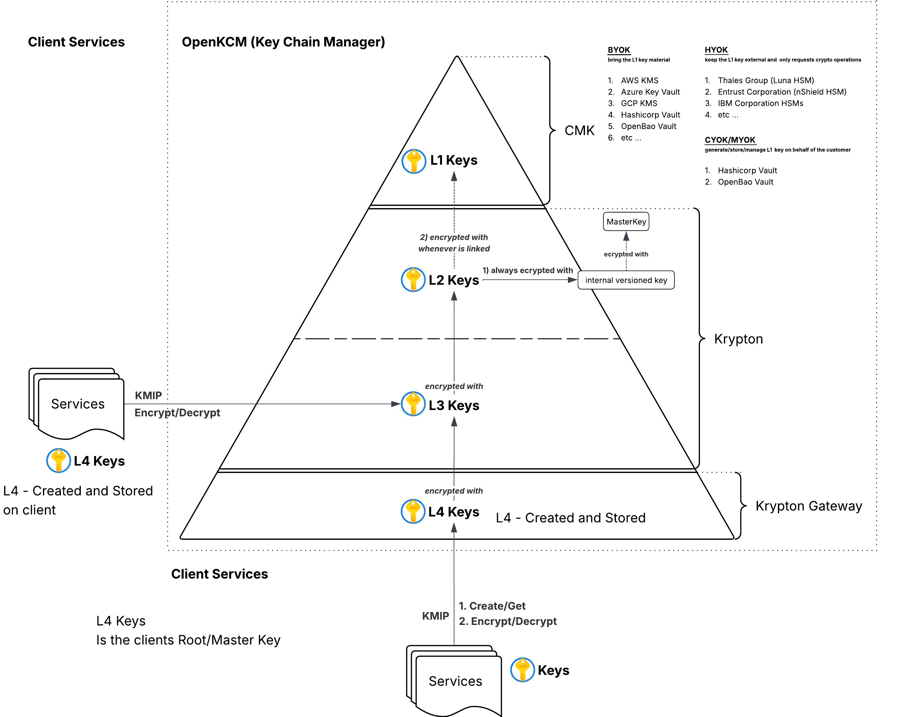
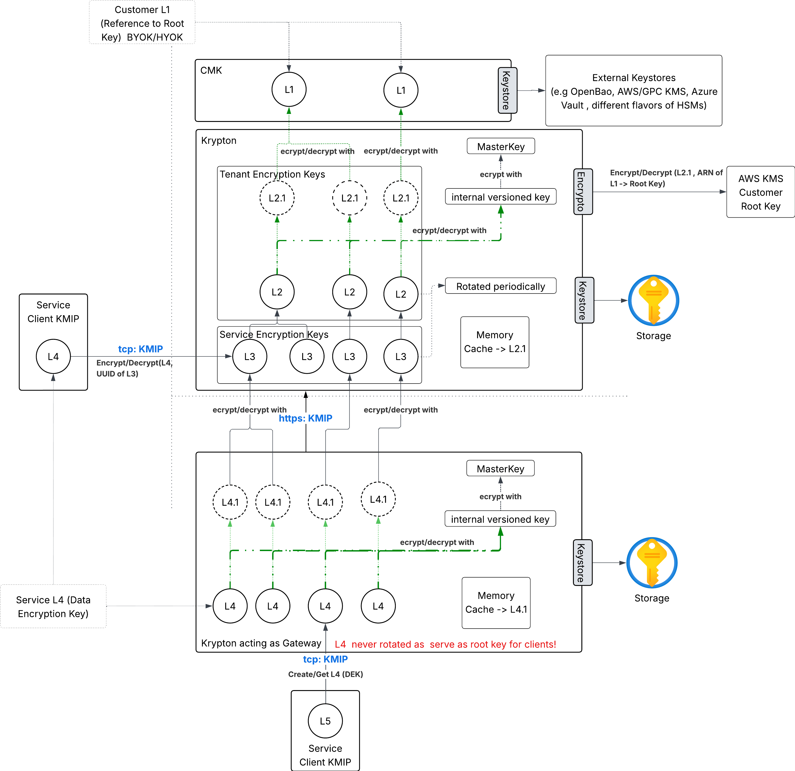

# Business Architecture & Sovereign Trust Model

## Executive Summary: The "Brain" and "Muscle" Architecture

In traditional cloud security, the service that *stores* your data usually holds the *keys* to that data. This creates a "concentration of risk"—if the provider is compromised or subpoenaed, your data is vulnerable.

OpenKCM resolves this by enforcing a strict **Separation of Duties**. We architecturally separate the **Governance Plane (The Brain)** from the **Execution Plane (The Muscle)**. This ensures that policy decisions are centralized and auditable, while cryptographic operations are distributed and fast.

### The High-Level Architecture
The diagram below illustrates how OpenKCM isolates governance from execution.

  <input type="checkbox" id="hla-zoom" class="zoom-toggle" />

<label for="hla-zoom" class="zoom-button">+</label>

  <label for="hla-zoom" class="diagram-overlay">
    
  </label>

**Strategic Components:**

* **The Brain: OpenKCM CMK (Governance Control Plane)**
    * **Role:** The Policy Maker. It manages *who* can access a key, but it never performs encryption itself.
    * **Business Value:** It holds the "Pointer" to your external Hardware Root of Trust (L1). It acts as a **Kill Switch**. If you delete the pointer here, the entire downstream system stops working instantly.
    * **Integration:** Connects to your corporate Identity Provider (IdP) and outputs audit logs to your SIEM, ensuring compliance visibility.

* **The Muscle: OpenKCM Crypto / Krypton (Execution Plane)**
    * **Role:** The Factory. It performs the heavy lifting of encryption (Wrapping/Unwrapping) using keys temporarily loaded into secure memory.
    * **Business Value:** It is distributed regionally (e.g., US-East, EU-Central). This ensures that data processing happens close to your applications for maximum speed, while strictly adhering to the policies defined by the Brain.

* **The Edge: Krypton Gateway**
    * **Role:** The Delivery Agent. Runs directly inside your application environment (Kubernetes/VPC).
    * **Business Value:** Provides "Hyperscale" performance by handling high-volume requests locally, only contacting the regional core for security validation.

## The Pyramid of Trust: 4-Layer Key Hierarchy

To balance **Sovereignty** (Customer Control) with **Scale** (Cloud Speed), OpenKCM uses a layered "Envelope Encryption" model. This pyramid structure ensures that the customer retains ultimate authority without needing to approve every single database transaction.

### The Cryptographic Hierarchy
The diagram below details the L1-L4 dependency tree and the Ownership Models (BYOK/HYOK).

  <input type="checkbox" id="hla-zoom" class="zoom-toggle" />

<label for="hla-zoom" class="zoom-button">+</label>

  <label for="hla-zoom" class="diagram-overlay">
    
  </label>

**The Layers Explained:**

* **L1 Keys (The Sovereign Anchor):**
    * **Owner:** **YOU (The Customer).**
    * **Location:** Your external KMS (AWS, Azure, GCP) or On-Premise HSM (Thales, Entrust).
    * **Function:** This is the root of the pyramid. OpenKCM never sees this key; we only ask permission to use it. If you revoke this key in your own console, the entire pyramid collapses, creating a "Cryptographic Lockout."

* **L2 & L3 Keys (The Intermediaries):**
    * **Owner:** OpenKCM (Managed on your behalf).
    * **Location:** Encrypted in the Regional Vault; active only in Secure Memory.
    * **Function:** These layers facilitate multi-tenancy. They allow us to isolate "Tenant A" from "Tenant B" and "Payment Service" from "Audit Service." They are cryptographically derived from your L1.

* **L4 Keys (The Data Keys):**
    * **Owner:** The Application / Gateway.
    * **Location:** Stored alongside your data (Database/Object Storage).
    * **Function:** These are the disposable, high-speed keys that encrypt actual files and records. They are generated locally for speed but are useless without the L3 key to unlock them.

**Supported Ownership Models:**
* **BYOK (Bring Your Own Key):** Link an L1 from AWS/Azure/GCP.
* **HYOK (Hold Your Own Key):** Keep the L1 in an on-premise HSM for maximum regulatory shielding.

## Operational Mechanics: The Chain of Custody

How do we ensure that a key is never exposed? The flow of trust relies on **Recursive Unsealing**. A lower-level key can only be decrypted if the level above it is active and authorized.

### The Unsealing Flow
The diagram below visualizes the technical flow of "Wrapping" and "Unwrapping" as data moves from the central store to the edge service.

  <input type="checkbox" id="hla-zoom" class="zoom-toggle" />

<label for="hla-zoom" class="zoom-button">+</label>

  <label for="hla-zoom" class="diagram-overlay">
    
  </label>

**The Trust Workflow:**

1.  **The Handshake (Top-Down):** When a region boots up, the **Krypton Core** contacts the **CMK** to locate the customer's L1. It then authenticates with the external provider (e.g., AWS KMS) to unseal the **L2 Tenant Key**.
2.  **The Derivation (Internal):** Once the L2 is in memory, the Core uses it to unlock the specific **L3 Service Keys** needed for that session.
3.  **The Transaction (Bottom-Up):**
    * The **Client App** (Service) requests an operation via the **Krypton Gateway**.
    * The Gateway generates an **L4 Key** locally.
    * The Gateway sends the L4 key to the Core to be "Wrapped" (Encrypted) by the L3.
    * **Result:** The application gets a secured key to write data, but the "Master Key" (L3) never left the secure Core.

## Summary of Business Benefits

By adopting this architecture, organizations achieve three critical goals:

1.  **Risk Reduction:** Compromising the "Edge" (Gateway) does not compromise the "Root" (L1/L2). The blast radius is contained.
2.  **Regulatory Compliance:** The strict L1-L4 hierarchy provides a clear, auditable chain of custody that satisfies GDPR, HIPAA, and Sovereignty requirements.
3.  **Operational Agility:** Developers get a standard API (KMIP) that works everywhere, while Security teams retain a global "Kill Switch" to protect the enterprise.