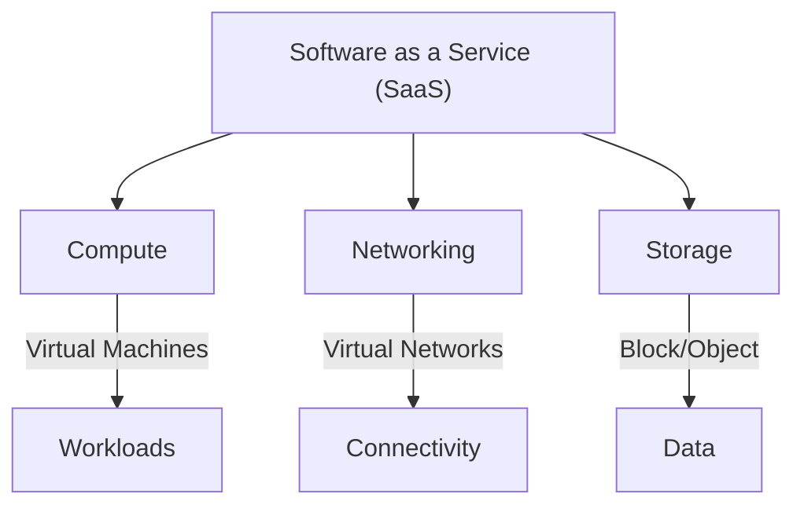
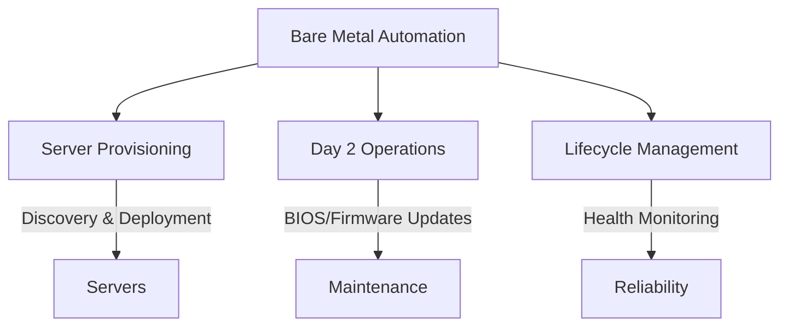

# Overview

OpenKCM bridges the gap between virtualized Software and physical hardware management, offering a unified 
solution for developers, system administrators, and enterprises. Explore the two core layers below to see how OpenKCM
can transform your workflows.

## OpenKCM Architecture

Here’s a visual representation of OpenKCM’s two layers:

**Software as a Service (SaaS)**

**Bare Metal Automation**

---

## Software as a Service (SaaS)

The SaaS layer provides a flexible, user-friendly environment to create and manage **Compute**, **Networking**, and 
**Storage** resources. With OpenKCM, you can:

- **Compute**: Spin up virtual machines or containers tailored to your workload needs.
- **Networking**: Configure virtual networks, load balancers, and firewalls with ease.
- **Storage**: Provision scalable block, object, or file storage to suit your applications.

Designed for simplicity and power, this layer abstracts the complexity of resource management, giving you cloud-like 
control at your fingertips.

**[Get Started with SaaS](/saas/getting-started)** 

**[API References](/saas/api-references/)**

---

## Bare Metal Automation

The Bare Metal Automation layer takes server management to the next level, handling everything from provisioning to ongoing maintenance. Key features include:

- **Server Provisioning**: Automate the discovery, configuration, and deployment of bare metal servers.
- **Day 2 Operations**: Simplify maintenance tasks like OS updates, BIOS/firmware upgrades, and hardware diagnostics.
- **Lifecycle Management**: Monitor and manage server health, ensuring peak performance and reliability.

This layer is perfect for those who need fine-grained control over physical hardware without sacrificing automation.

**[Get Started with Bare Metal Automation](/baremetal/)**
